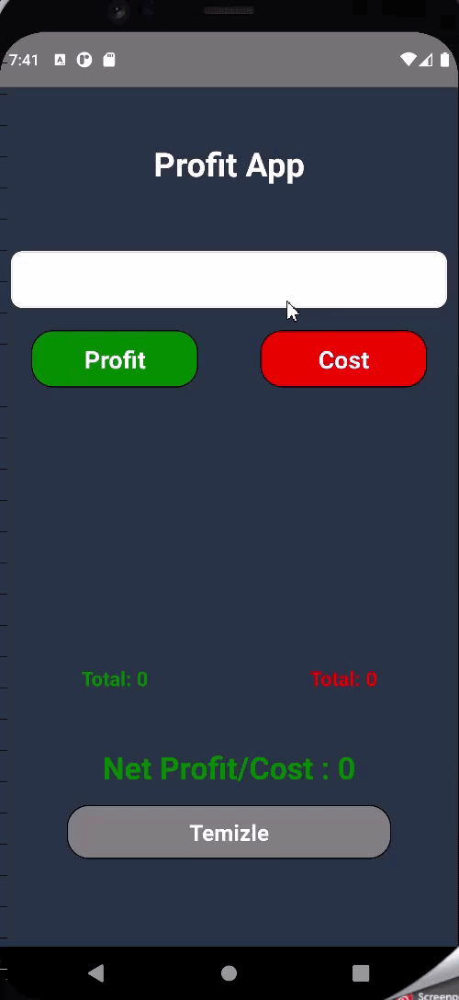

# Codemark

## Kullanılan Diller
- React
- React Native
- Redux Toolkit

React Native

## Özellikler

* Anlık olarak kar-zarar toplamı ve net durmu hesaplama

 


## Başlangıç
Bu depoyu yerel makinenizde klonlayın.
```
git clone https://github.com/Lyndray/ProfitApp-withRedux.git
```

Kullanım
* Proje bağımlılıklarını yüklemek için proje klasörüne aşağıdaki komutları çalıştırın.

```
npm init
npm install
```

Bu talimatlar, geliştirme ve test amacıyla yerel makinenizde projenin bir kopyasını hazır ve çalışır hale getirecektir.

Kullanılabilir Komut Dosyaları
Proje dizininde şunları çalıştırabilirsiniz:
```
npx react-native run-android
```
